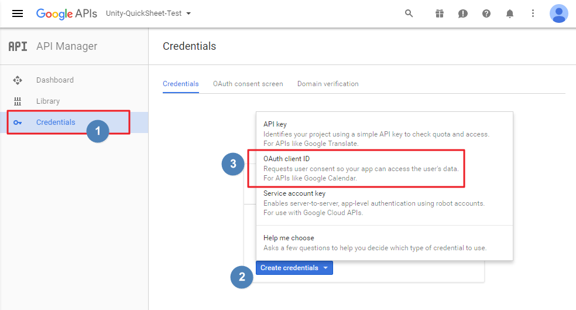
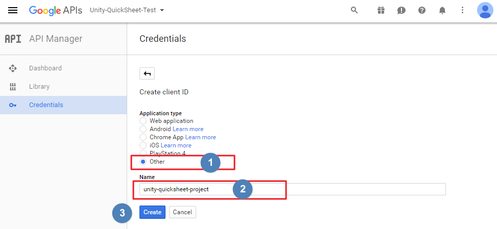
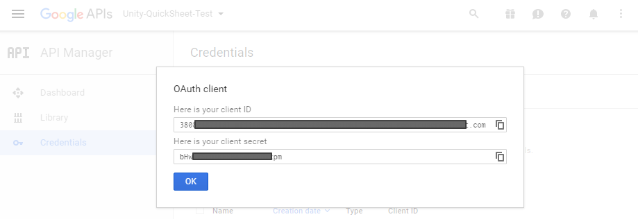
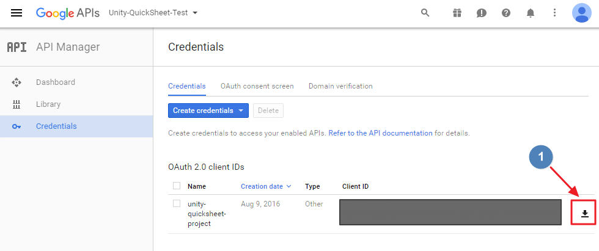

# Setting up OAuth2 for accessing Google Drive

## OAuth2 setting on Google APIs

To access google drive, especially google spreadsheet for Unity-Quicksheet, 
it requires OAuth2 authentication. 
To set this up visit [Google APIs](http://console.developers.google.com) page and 
create a new project.

The next describes the way of getting *'client_ID'* and *'client_secret'* tokens 
which are necessary for oauth2 credentials step by step. 

Select *1)* `Credentials` on the left panel and `Credential` tab on the top menu 
then click *2)* `Create credentials` button which open a dialogue shows credential types you can create.

Select *3)* `OAuth client ID` otherwise you may have wrong format of json file.

Select *1)* ***othter*** for `Application type` and *2)* insert a proper name into the `Name` field, 
then press *3)* *'Create'* button will create a credential.

You can now see *'client_ID'* and *'client_secret'* for newly created credential.

At this moment you can directly copy and paste those *'client_ID'* and *'client_secret'* 
into **Unity-Quicksheet**'s google setting or download oauth2 json file which 
contains *'client_ID'* and *'client_secret'*. 

Finally, click *1)* the download icon for downloading json file which contains *'client_ID'* and *'client_secret'*.

## OAuth2 setting on Unity-Quicksheet

Things for authentication on Google side are done and it is time to setting up remains for accessing google's spreadsheet on Unity side.

See the OAuth2 Google Service Account section on the [Google Spreadsheet Howto page](http://kimsama.github.io/googlehowto/) for more details.
