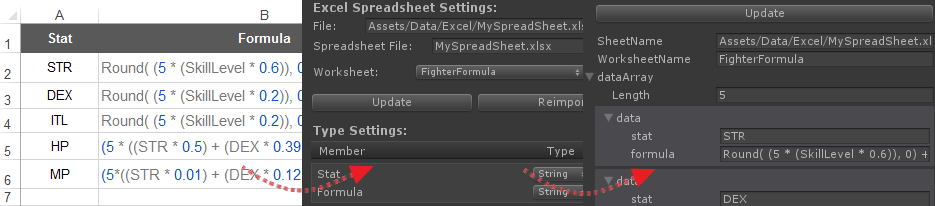

# Unity-QuickSheet

    
    

Unity-QuickSheet enables you to use google and excel spreadsheet data within Unity editor. With Unity-QuickSheet, you can retrieve data from a spreadsheet and save it as an asset file with a [ScriptableObject](http://docs.unity3d.com/ScriptReference/ScriptableObject.html) format even without writing single line of code.

  

## Features

* **_Easy!_** No need to write any single line of code.
* **_Convenient!_** It can retrieve data from excel file. (both of xls and xlsx format are supported on Windows, only xls on OSX.)
* **_Flexible!_** It can also retrieve data from google spreadsheet.
* **_Fast!_** No need to write a parser to retrieve data, it automatically serializes retrieved data into Unity3D's [ScriptableObject](http://docs.unity3d.com/ScriptReference/ScriptableObject.html), the binary format and so it is fast than to use XML which is usually ASCII format.

Saying again, you don't need to write even single line of code to import data from a spreadsheet whatever Excel or Google spreadsheet.

## Documentaion

Documentation, located on GitBook site found on [here](https://kimsama.gitbooks.io/unity-quicksheet/content/).

> Also you can find ['Unity-Quicksheet.pdf'](https://github.com/kimsama/Unity-QuickSheet/blob/master/Assets/QuickSheet/Doc/Unity-Quicksheet.pdf), a pdf file same as the one on the [GitBook page](https://kimsama.gitbooks.io/unity-quicksheet/content/)

* **Release Note**: See the [Release](https://github.com/kimsama/Unity-QuickSheet/releases) page for change log.
* **Unity Forum**: You can also find *'Unity-Quicksheet'* on the Unity forum page found on [here](http://forum.unity3d.com/threads/released-unity-quicksheet.289146/). Any feedbacks, patches or suggestions are always welcome!

## References

* [Unity Serialization](http://forum.unity3d.com/threads/155352-Serialization-Best-Practices-Megapost) on Unity's forum for details of serialization mechanism.
* [GDataDB](https://github.com/mausch/GDataDB) is used to retrieve data from Google Spreadsheet. Note that [GDataDB](https://github.com/mausch/GDataDB) is slightly modified to support *enum* type.
* [NPOI](https://npoi.codeplex.com/) is used to read xls and xlsx file.
* All "*.dll" files of Google Data SDK are available at [Google Data API SDK](https://code.google.com/p/google-gdata/downloads/detail?name=libgoogle-data-mono-2.1.0.0.tar.gz&can=2&q=)
* Newtonsoft.Json source code for net 2.0 is available at [here](https://github.com/JamesNK/Newtonsoft.Json)
* [Unity-GoogleData](https://github.com/kimsama/Unity-GoogleData), my previous effort to import a spreadsheet data into Unity.

## License

This code is distributed under the terms and conditions of the MIT license.

> Other code or libraries borrowed from [GDataDB](https://github.com/mausch/GDataDB), [NPOI](https://npoi.codeplex.com/) and [Google Data API SDK](https://code.google.com/p/google-gdata/downloads/detail?name=libgoogle-data-mono-2.1.0.0.tar.gz&can=2&q=) follow its license.

Copyright (c) 2013 Kim, Hyoun Woo
