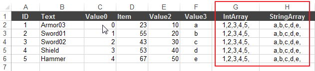
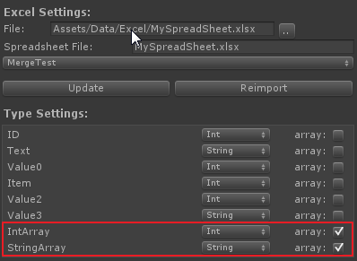
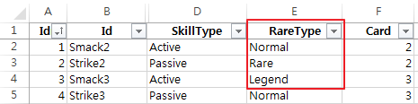

Unity-QuickSheet
====================

Unity-QuickSheet enables you to use google and excel spreadsheet data within Unity editor. With Unity-QuickSheet, you can retrieve data from a spreadsheet and save it as an asset file with a [ScriptableObject](http://docs.unity3d.com/ScriptReference/ScriptableObject.html) format even without writing single line of code.


Features
--------
* No need to write any single line of code.
* It can retrieve data from excel file. (both of xls and xlsx format are supported.)
* It can retrieve data from google spreadsheet.
* No need to write a parser to retrieve data, it automatically serializes retrieved data into Unity3D's [ScriptableObject](http://docs.unity3d.com/ScriptReference/ScriptableObject.html), the binary format and so it is fast than to use XML which is usually ASCII format.

Saying again, you don't need to write even single line of code!


Getting Started
---------------

* [Excel Howto](http://kimsama.github.io/excel-howto/) 
* [Google Spreadsheet Howto](http://kimsama.github.io/googlehowto/) 

Usage
-----

* Using [LINQ](https://code.msdn.microsoft.com/101-LINQ-Samples-3fb9811b) with QuickSheet
* Enum with QuickSheet
* NGUI localization with QuickSheet
* Automation of formula calculation

### Using Array type with QuickSheet

You can use array type with comma sperated values in a cell as the following:



Note that don't miss the last comma which should be after a last value in a cell.

```
1,2,3,4,5, -> Don't miss the comma right after '5' if not, the value '5' will not imported to an asset file.
```

After importing with the given excel file, specify type of each column-header and check *array* option for an array type.



It will generate array type memeber field of a data class with the specified type as the following code:

```csharp
	[SerializeField]
	int[] intarray = new int[0];
	
	[ExposeProperty]
	public int[] Intarray { get {return intarray; } set { intarray = value;} }
	
	[SerializeField]
	string[] stringarray = new string[0];
	
	[ExposeProperty]
	public string[] Stringarray { get {return stringarray; } set { stringarray = value;} }
```

### Using Enum type with QuickSheet

Specify enum type for a data class is easy. Let's say that you want to set enum type for *'RareType'* on a sheet of excel file as the following:



The 'RareType' only can have one of value from three type which are *Normal*, *Rare* and *Legend*. 

Because QuickSheet can not generate enum itself, you should first declare an enum type before generating script files.

Create an empty .cs file which usually contains various enums then declare 'RareType' enum type what for you've set on the spreadsheet.


```csharp
public enum RareType
{
	Normal,
	Rare,
	Legend,
}
```

Now you can generate necessary script files without an error!


Add QuickSheet via subtree
-----------------------------

You can add QuickSheet via subtree to your github project like the following:

```
git subtree add --prefix=Assets/QuickSheet https://github.com/your_github_account/your_project.git QuickSheet 
```

It creates *QuickSheet* folder under *Assets* unity project folder then put all the neccessary files under the *QuickSheet* folder.

Any changes for the remote repository easily can pull with *git subtree pull* as the following:

```
git subtree pull --prefix=Assets/QuickSheet https://github.com/kimsama/Unity-QuickSheet.git QuickSheet 
```

Limitations
-----------

* *[ScritableObject](http://docs.unity3d.com/ScriptReference/ScriptableObject.html)* does not allow to save data changed on runtime. So if you need to serialize and save things that changes on runtime, you need to look at other methods of serialization such as JSON, BSON or XML, depending on your platform and/or requirements.

* Google Spreadsheet plugin does not work in the Unity web player's security sandbox. You should change the *Platform* to *'Stand Alone'* or something else such as *'iOS'* or *'Android'* platform in the Unity's [Build Setting](http://docs.unity3d.com/Manual/PublishingBuilds.html).


References
----------
* [Unity Serialization](http://forum.unity3d.com/threads/155352-Serialization-Best-Practices-Megapost) on Unity's forum for details of serialization mechanism.
* [GDataDB](https://github.com/mausch/GDataDB) is used to retrieve data from Google Spreadsheet. Note that [GDataDB](https://github.com/mausch/GDataDB) is slightly modified to support *enum* type.
* [ExposeProperties](http://wiki.unity3d.com/index.php/Expose_properties_in_inspector) is used to easily expose variables of spreadsheet on the Unity3D's inspector view and let [GDataDB](https://github.com/mausch/GDataDB) access through get/set accessors.
* [NPOI](https://npoi.codeplex.com/) is used to read xls and xlsx file.
* [Unity-GoogleData](https://github.com/kimsama/Unity-GoogleData), my previous effort to import a spreadsheet data to Unity.

License
-------

This code is distributed under the terms and conditions of the MIT license.

Some codes are borrowed from [GDataDB](https://github.com/mausch/GDataDB) and [ExposeProperties](http://wiki.unity3d.com/index.php/Expose_properties_in_inspector). The license of the that follow theirs.

Copyright (c) 2013 Kim, Hyoun Woo


